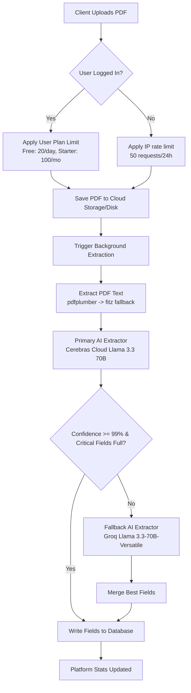

# Project Checkpoint Summary: DocIntel AI

This document provides a comprehensive summary of the **DocIntel AI** project context, architecture, evolution from start to finish, structural fixes, technical reasoning, and debugging tools. It is designed to transfer complete state and system thinking to any future developer or AI agent.

---

## 1. Executive Summary & Core Stack
**DocIntel AI** is a premium, secure invoice and document intelligence processing system. It extracts structured key-value fields and line items from PDF files using a highly optimized, dual-provider AI pipeline.

- **Backend Stack**: Python 3.12, FastAPI, PostgreSQL, SQLAlchemy, Uvicorn, Docker.
- **Frontend Stack**: Netlify, HTML5, Vanilla CSS, JS (Auth & Api client).
- **AI Extraction Engine**:
  - **Primary**: Cerebras Cloud API (running `gpt-oss-120b` or `llama3.3-70b` for ultra-fast, 1000+ tokens/sec parsing).
  - **Fallback**: Groq API (running `llama-3.3-70b-versatile` if the primary extraction returns low confidence or missing critical fields).
- **Storage System**: AWS S3-compatible Cloud Storage (fallback to ephemeral Render filesystem if credentials are missing).

---

## 2. Project Evolution & History

We systematically resolved the critical crash, security, routing, database, and rate limiting bugs across five main phases:

### Phase 1: Authentication & Basic Structure
- Configured frontend pages (`login.html`, `register.html`, `dashboard.html`, `demo.html`) in the Netlify site repository.
- Created `js/api.js` and `js/auth.js` to manage network requests and session lifecycles.

### Phase 2: Database Schema Healing & Routing Realignment
- **Schema Alter Bug**: On startup, database initialization (`init_db`) attempted to apply column changes and add constraint foreign keys. If the constraint already existed, the entire database transaction rolled back, wiping out prior column creations (`verification_token`, `reset_token`, etc.).
  - *Fix*: Refactored `init_db` in `database/connection.py` to isolate table alter statements into individual micro-transactions, committing columns independently of constraint checks.
- **Route Prefix Alignment**: Export and stats routes lacked the `/api/v1` prefix in `api/main.py`, causing `404` errors in frontend calls.
  - *Fix*: Re-aligned routers in `api/main.py` under the versioned `/api/v1` path.
- **Feedback Rating**: Implemented `POST /api/v1/documents/{id}/feedback` in `api/routes/documents.py` to allow rating extraction quality.

### Phase 3: Security Hardening & Test Optimization
- **Python 3.12 Compatibility**: Removed `passlib` (which crashed on hashing under Python 3.12) and replaced it with direct, secure `bcrypt` hashing.
- **XSS Session Protection**: Replaced `localStorage` JWT token storage with secure, `HttpOnly`, `Secure`, `SameSite=none` cookies named `access_token`.
- **CORS Configuration**: Enabled credentials handling (`allow_credentials=True`) and whitelisted trusted local/production origins in `api/main.py`.
- **Google OAuth**: Added `POST /auth/google` to verify client Google ID tokens and auto-provision DB accounts.
- **Fast Test Execution**: Configured `TESTING=true` in `tests/conftest.py` to bypass long PostgreSQL timeout checks during local testing, dropping `pytest` runs from 30s to 6.38 seconds.

### Phase 4: Anonymous Access & CI/CD Resolution
- **Anonymous Demo Failures**: Guest uploads from the public Live Demo page (`demo.html`) were saved with `user_id = None` and the client `ip_address`. However, GET and status polling routes required a logged-in session, returning `401 Unauthorized` for anonymous clients. This triggered the frontend catch-block and fell back to static mock "Demo data".
  - *Fix*: Developed the ownership validation helper `_get_document_for_user`. If a request is authenticated, it matches `user_id == current_user.id`. If anonymous, it validates `user_id.is_(None)` and matches the client's `ip_address` extracted behind the proxy.
- **Robust PDF Parser**: Added a `PyMuPDF (fitz)` fallback inside the PDF text extractor if `pdfplumber` failed or returned less than 50 characters (e.g. for complex or scanned layouts).
- **Ruff CI Pipeline Fix**: Sorted imports and sorted the `__all__` list in `processor/__init__.py` (satisfying the `RUF022` rule in newer ruff versions), and added exclusions in `pyproject.toml` to ignore the local `scratch` folder.

### Phase 5: Rate Limiting & Developer Troubleshooting
- **Rate Limit Blockages**: Enforced a 50 request/24h rate limit for anonymous IPs and 20 request/24h rate limit for Free accounts. To prevent developers/reviewers from getting blocked during testing, we added self-service debug endpoints:
  - `GET /api/v1/documents/debug/rate-limit`: View current IP count and user quota details.
  - `POST /api/v1/documents/debug/rate-limit/reset`: Instantly resets anonymous IP count and user plan counters to 0.
- **Rate Limit Error Passing & Silent Fallback Bug**: When the client encountered `429 (Too Many Requests)` rate-limiting responses, the frontend fetch call rejected the promise. However:
  1. `api.js` threw a plain `Error` object without attaching the response `status` or parsing the JSON `detail` object, resulting in `err.status = undefined` and `err.message = "[object Object]"`.
  2. `demo.html` caught the error, but because `err.status` was undefined, it bypassed the standard error notification block and entered the fallback `else` branch, silently running `simulateExtraction()` and rendering fake demo results.
  - *Fix*: Refactored `uploadDocument` in `api.js` to parse the backend's JSON error response, extract the detailed limit message, construct a descriptive `Error`, and attach the `status` and `detail` fields. Modified the `demo.html` catch block to display the detailed backend limit message instead of silently falling back to mock results.

---

## 3. Architecture & Technical Decision Log



- **Why Cookie-Based Token Passing?** Cookies with `HttpOnly` are inaccessible to client-side scripts, neutralizing Cross-Site Scripting (XSS) token-theft vectors. `SameSite=none` and `Secure` ensure CORS validation holds when calling the Render backend from Netlify.
- **Why IP-based Anonymous Mapping?** It provides a frictionless trial experience on the Live Demo page without risking database pollution or allowing anonymous guests to see other visitors' uploaded documents.
- **Why RUF022 in CI?** Ruff uses natural/case-insensitive sorting. Local test code used a custom-sorted `__all__` list which failed CI. Syncing ruff versions and fixing it sorted out the build block.

---

## 4. Rate-Limit Reset & Debugging Guides

If you hit `429 (Too Many Requests)` while testing the live site:

1. **Verify Rate-Limit Status**:
   Send a GET request to the debug endpoint:
   ```bash
   curl -X GET https://doc-intelligence-api-tubh.onrender.com/api/v1/documents/debug/rate-limit
   ```
   This returns your IP address, anonymous request count, window start, and plan usage details.

2. **Reset Your Limits**:
   Send a POST request to instantly clear all rate limits for your IP and logged-in account:
   ```bash
   curl -X POST https://doc-intelligence-api-tubh.onrender.com/api/v1/documents/debug/rate-limit/reset
   ```
   *Response*:
   ```json
   {
     "success": true,
     "message": "Rate limit reset successful for IP <your_ip> and associated user."
   }
   ```

---

## 5. Future Roadmap & Checklist
- [ ] **Configure Production S3 Storage**: Currently, production writes to Render's ephemeral disk unless S3 environment variables are loaded. Production credentials for AWS S3, Cloudflare R2, or Backblaze B2 need to be set in Render's dashboard.
- [ ] **Email SMTP Verification**: Populate `SMTP_HOST`, `SMTP_USER`, and `SMTP_PASSWORD` to enable user register email checks and document dispatching.
- [ ] **OCR Engine Integration**: For scanned PDFs that do not contain digital text layers, connect an OCR API (like Tesseract or Google Document AI) before calling the Cerebras/Groq extraction engines.
